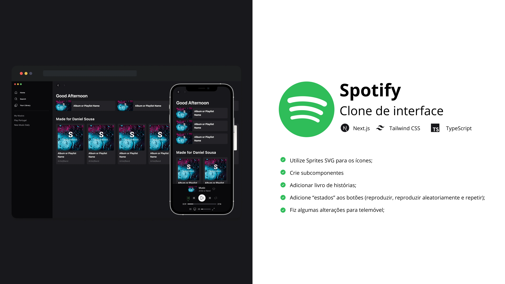
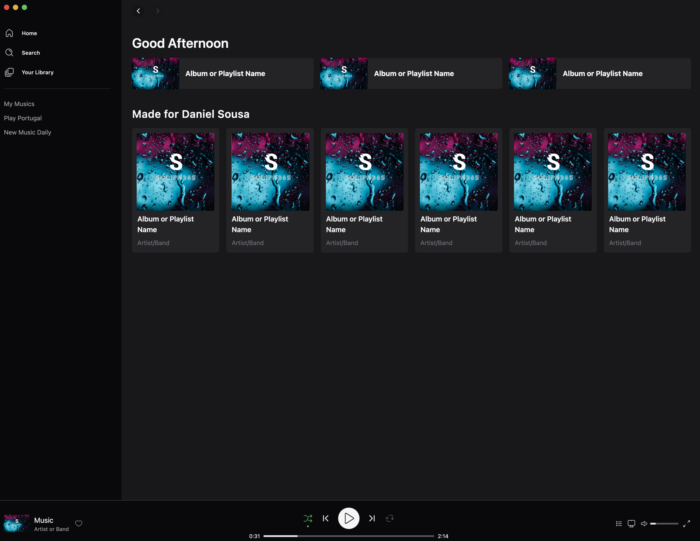
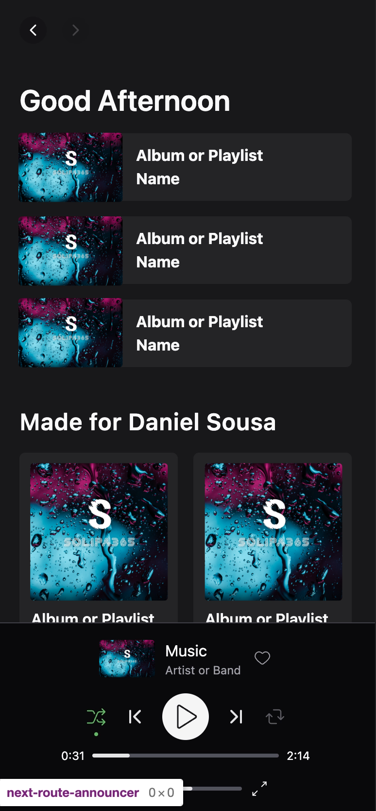

# Tailwind CSS Spotify

Este repositório contém o código após o [**Rocketseat**] clonar a interface do **Spotify** utilizando o **TailwindCSS** e o **Next.js**. **Link abaixo** 👇

 

Como é habitual, neste repositório pode encontrar algumas alterações em comparação com o projeto do curso.

## 🛠 Competências

## 📄 Mudanças

- [x] Utilize SVG Sprite para os ícones;
- [x] Converter ativos estáticos de `. png`/`. jpg` para `. webp`;
- [x] Criar componentes e adicionar algumas interações em botões;
- [x] Adicionar **StoryBook** e `. stories`;
- [x] Adicionar configuração **ESLint**.;
- [x] Adicionar configuração **mais bonita**.;
- [x] Adicionar **commitlint**;
- [x] Adicione **Husky** e **LintStaged** para adicionar ganchos de commit.

### Melhorias/Lista de tarefas

- [x] Utilizar configuração personalizada **ESLint**;
- [ ] Melhorar a versão mobile;

## 🌃 Galeria

Versão para Desktop

Versão Móvel

## 🔗 Mais sobre mim

 
 

 
